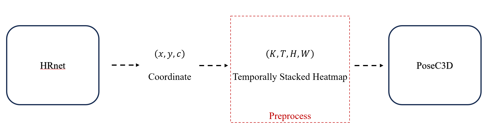

# Environment Setting

### Conda Environment Settings

1. `python.__version__ == 3.9`
```bash
conda create -n ${ENV_NAME} python=3.9
```
2. CUDA, Pytorch Version

해당 코드는 CUDA 11.8, PyTorch 2.0.0 버전으로 실험되었다.
```bash
pip install torch==2.0.0+cu118 torchvision==0.15.1+cu118 torchaudio==2.0.1+cu118 --index-url https://download.pytorch.org/whl/cu118
```

### MMAction Installation

**Install Dependency**
```bash
pip install -U openmim
mim install "mmengine==0.10.5"
mim install "mmcv==2.1.0"
mim install "mmdet==3.2.0"
mim install "mmpose==1.3.2"
```

**Build mmaction from source**
```bash
pip install -e .
```

이렇게 구성하여 export한 conda environment yaml파일은 `conda_environment.yaml`에 저장되어 있다.

# Train & Test
## Train

```bash
python tools/train.py ${CONFIG_FILE} [optional arguments]
```

_Example_
```bash
python tools/train.py pipeline_integration/demo_configs/custom_violence_keypoint_epoch300_batch8.py
```

## Test

```bash
python tools/test.py ${CONFIG_FILE} ${CHECKPOINT_FILE} [optional arguments]
```

_Example_
```bash
python tools/test.pypipeline_integration/demo_configs/custom_violence_keypoint_epoch300_batch8.py pipeline_integration/weights/best_acc_top1_epoch_264.pth
```


# Pipeline Integration - Code Execution
작업한 추론 코드는 `pipeline_integration` 폴더 내에 위치해 있다.

## Notification
### Pipeline
Violence Detection에 사용하는 Action Recognition Model은 [PoseC3D](https://arxiv.org/abs/2104.13586)이다. 

Top-down Pose Estimation의 출력 Heatmap들을 각 join 별로 temporarily stack하여 action classification을 하는 기법인데, 논문의 3.2. From 2D Poses to 3D Heatmap Volumes 부분에서 heatmap보다 keypoint coordinate로 Pose 추론 값을 저장하고 다시 Heatmap 형태로 복원하여 사용하는 것이 성능 손실이 거의 없이 storage space를 아낄 수 있다고 언급한다.

> In experiments, we find that coordinate-triplets (x,y,c) help save the majority of storage space at the cost of little performance drop.

이에 따라 현재 작성한 추론 코드도 Pipeline을 다음과 같이 구축하며, COCO 기반 Keypoint Coordinate를 지니고 있다고 가정하고 구현되었다.



### Multi-person Inference
Top-down based HRNet을 기반으로 single person에 대해 action inference를 하기에 사람이 많아질 수록 linear하게 연산량이 증가할 수 있다.

### Model Configfile
추후 Class 갯수 변경 등, 추가적인 학습데이터 재구성이 있을 수 있어 config 파일 및 가중치가 변경될 수 있다.

## `pipeline_integration/extract_pose.py`
#### Pose Extraction Example  
```bash
python pipeline_integration/extract_pose.py --video-path ./pipeline_build/long_subset/1_074_1_01.mp4
```
활용하는 Action Recognition Model인 [PoseC3D](https://arxiv.org/abs/2104.13586) 모델이 원하는 Human Pose Keypoint들의 형태로 뽑아 `pipeline_build/sample/long_subset`내에 저장하는 코드.

이때 활용한 Human Pose Estimation Model은 [HRNet-w32](https://arxiv.org/abs/1908.07919) 이며 저장된 형태는 다음과 같다.

`List[List[dict]]`의 Shape를 지니며

`len(List[List[dict]])==num_people`,
`len(List[dict])==num_frames` 값을 지닌다.

`dict`의 형태는 다음과 같다.
```python
[
    [
        {
            'bbox_scores': array([1.], dtype=float32),
            'bboxes': array([[443.81, 159.72, 532.91, 336.49]]),
            'keypoint_scores': array([[0.875257  , 0.8032905 , 0.90061617, 0.6363667 , 0.8965926, 0.7831787 , 0.8786333 , 0.322353  , 0.9310938 , 0.22244653, 0.9125471 , 0.7968693 , 0.78160095, 0.87491614, 0.885747  ,
            0.8881028 , 0.9050592 ]], dtype=float32),
            'keypoints': array([[[480.5918 , 179.91736],
                    [480.5918 , 176.46481],
                    [478.8655 , 178.19109],
                    [470.23416, 181.64362],
                    [470.23416, 181.64362],
                    [470.23416, 193.72751],
                    [459.87656, 200.63258],
                    [484.0443 , 210.9902 ],
                    [484.0443 , 217.89528],
                    [501.307  , 205.8114 ],
                    [504.75955, 204.08513],
                    [478.8655 , 238.61052],
                    [465.05536, 243.78932],
                    [497.8545 , 271.40964],
                    [471.96045, 280.041  ],
                    [508.2121 , 311.11383],
                    [470.23416, 319.74518]]], dtype=float32),
            'keypoints_visible': array([[0.875257  , 0.8032905 , 0.90061617, 0.6363667 , 0.8965926 ,
                    0.7831787 , 0.8786333 , 0.322353  , 0.9310938 , 0.22244653,
                    0.9125471 , 0.7968693 , 0.78160095, 0.87491614, 0.885747  ,
                    0.8881028 , 0.9050592 ]], dtype=float32),
        }
    ],
    ...
]
```


## `pipeline_integration/inference.py`
```bash
python pipeline_integration/inference.py --pose-file-path pipeline_integration/sample/long_subset/1_071_1_04.pkl --clip-len 48 --predict-step-size 12 --device cuda:0
```
extract_pose.py로 뽑은 pkl 파일들을 input으로 하여 sliding window fashion으로 inference를 구현.


### Temporal Sliding Window Inference Logic
입력받는 전체 동영상 프레임을 clip_len 만큼의 프레임들로 이루어진 작은 영상(clip)들로 쪼개어 sliding window fashion으로 각 clip을 PoseC3d 모델에 inference한다.


각 사람(track_id)별 포즈 데이터에 대해 다음을 처리한다.

1. 각 사람(track_id) 별로 포즈 데이터를 전처리

    - temporal sliding window

        - clip_len * frame_interval 크기의 sliding window 사용.

        - sliding window clip 생성 후, 각 클립 별 포즈 데이터 정리.


2. 각 사람(track_id)별 clip 단위로 PoseC3d Model 추론:

    - window를 predict_step_size 만큼의 frame을 이동하면서 PoseC3d Model inference.

    - 추론한 clip의 frame index와 함께 Action Recognition 결과 집계

    - `pipeline_build/sample/results`에 pkl 파일로 저장.

### Input/Output
입력:
- `pipeline_integration/inference.py`로 추출한 Pose Data.

최종 출력:
- 'pred_score': 출력된 각 action class 별 확률
- 'frame_index': 추론된 frame index들의 배열

pkl 파일에 저장되는 데이터의 형태는 다음과 같다. `List[List[dict]]`

`len(List[List[dict]])==num_person`

`len(List[dict])` 는 inference하는 clip의 갯수이다.

```python
[ 
    [
        {
            'pred_score': array([
                0.00093905, 0.00426766, 0.28390622, 0.01333115, 0.00408716,
                0.04153658, 0.64740133, 0.00453098], dtype=float32), 
            'pred_label': array([6]), 
            'frame_index': [
                0, 1, 2, 3, 4, 5, 6, 7, 8, 9, 10, 11, 12, 13, 14, 15, 16, 17, 18, 19, 20, 21, 22, 23, 24, 25, 26, 27, 28, 29, 30, 31, 32, 33, 34, 35, 36, 37, 38, 39, 40, 41, 42, 43, 44, 45, 46, 47
            ]
        },
        ...,
    ]
]
```

